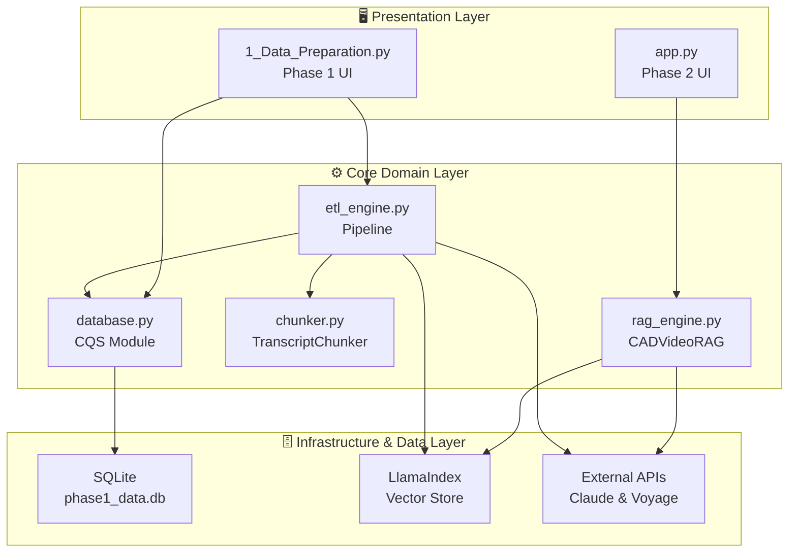

```mermaid
flowchart TD
    subgraph PRES["🖥️ Presentation Layer"]
        app["app.py\nPhase 2 UI"]
        prep["1_Data_Preparation.py\nPhase 1 UI"]
    end

    subgraph CORE["⚙️ Core Domain Layer"]
        rag["rag_engine.py\nCADVideoRAG"]
        etl["etl_engine.py\nPipeline"]
        chunker["chunker.py\nTranscriptChunker"]
        db["database.py\nCQS Module"]
    end

    subgraph INFRA["🗄️ Infrastructure & Data Layer"]
        sqlite["SQLite\nphase1_data.db"]
        vector["LlamaIndex\nVector Store"]
        apis["External APIs\nClaude & Voyage"]
    end

    app --> rag
    rag --> vector
    rag --> apis

    prep --> etl
    prep --> db
    etl --> db
    etl --> chunker
    etl --> vector
    etl --> apis
    db --> sqlite
```
